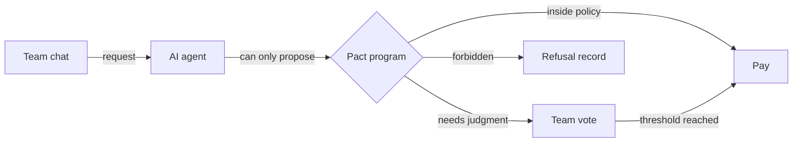

  <h3>Your team's treasury, run by an agent, guarded by the chain.</h3>
  

    
    
    
  

Pact is an AI treasurer for crypto teams. It handles routine payments automatically, turns exceptional payments into a vote where the team already works, and refuses anything outside the team's on-chain policy.

The agent can propose. **Only the chain can permit.**

## The missing middle

Crypto teams choose between two bad defaults. A founder's hot wallet is fast, but one key controls everything. A multisig is safer, but requiring a signing ceremony for every payment creates enough friction that people route around it.

Pact gives each payment the right amount of friction: operational speed for routine work, collective judgment for exceptions, and a hard boundary for forbidden actions.

| **Auto** | **Vote** | **Never** |
| --- | --- | --- |
| Known recipient, inside payment and weekly caps | Valid payment above an automatic limit | Unknown recipient, expired policy, or forbidden action |
| Pay and post the receipt | Open an `n-of-m` request in Telegram | Move no money and record why |

This is **graduated authority**: speed for routine work, team approval for exceptions, and a provable refusal for everything else.

## Why this matters now

- **More signatures do not fix a compromised approval screen.** The [2025 Bybit breach](https://www.bleepingcomputer.com/news/security/lazarus-hacked-bybit-via-breached-safe-wallet-developer-machine/) showed how multiple signers can approve the same falsified transaction context.
- **A pasted address is a security boundary.** A [USENIX 2025 study](https://arxiv.org/abs/2501.16681) found 6,633 successful address-poisoning attacks on Ethereum and BSC between 2022 and 2024.
- **Agents are beginning to move real money.** The [Lobstar Wilde incident](https://www.theblock.co/post/390722/ai-agent-created-by-openai-dev-accidentally-sends-entire-memecoin-holdings-to-reply-guy) demonstrated that prompts are intentions, not enforceable limits.
- **Policy is becoming the product.** Products such as [Squads](https://squads.xyz/multisig) and [Safe](https://docs.safe.global/home/ai-agent-quickstarts/agent-with-spending-limit) are adding spending controls, validating the category while raising the bar for depth.

Pact's thesis is simple: **a treasury is protected by a policy a compromised screen cannot change—not by adding more eyes to the same screen.**

## What makes Pact different

| Primitive | What it changes |
| --- | --- |
| **On-chain policy** | A compromised agent, UI, or server cannot widen its own authority. |
| **Governed recipients** | A new address requires a vote, a waiting period, and survives a veto window before it becomes payable. |
| **Durable refusals** | A blocked proposal moves no money but leaves a readable on-chain record instead of disappearing in a reverted transaction. |
| **Approvals in context** | Over-limit payments become one-tap requests in Telegram rather than another dashboard to monitor. |
| **Team-controlled exit** | Any member can revoke the agent; the vault remains the team's. |

## One week with Pact

| Request | Policy outcome | Result |
| --- | --- | --- |
| Designer invoice for **$450** | Known recipient, inside caps | Paid automatically; receipt posted to chat |
| Audit deposit for **$6,000** | Above the automatic limit | Two founders approve; the second approval pays |
| Invoice with a lookalike address | Recipient is not registered | Refused as `NOT_ALLOWLISTED`; attempt preserved |
| New contributor address | Recipient is not active yet | Vote, delay, and veto window before activation |

Paid, pending, and refused actions form one auditable timeline, with chain links that can be verified without trusting Pact's database.

## How trust is split

The Telegram bot, agent, indexer, and interface are convenience layers. Enforcement lives in the Solana program. Turn every Pact server off and the vault still applies the same recipient rules, limits, approvals, and expiry.

## What we are proving

Pact is currently **in development**. The first devnet build proves the complete trust model through:

- deterministic treasury policies and payment caps;
- recipient proposal, approval, delay, and veto;
- automatic payments and threshold approval requests;
- durable, human-readable refusal records;
- a Telegram bot and Mini App approval flow;
- immediate agent revocation and a team-controlled exit path.

The prototype is not for production funds. Mainnet remains gated on testing, an external audit, conservative limits, and operational review.

## The path after the demo

The product test is whether crypto teams run real contributor and vendor payments through Pact for a month.

1. Prove the core loop on devnet: request, policy decision, approval or refusal, and receipt.
2. Pilot with teams that coordinate treasury work in Telegram.
3. Explore Pact's agent and policy layer on top of smart accounts such as Squads.
4. Approach mainnet only after independent technical and operational review.

  <h3>Four voices. One treasury. One pact.</h3>
  
Built for teams that want agents to do the work—not define the limits.

  
<a href="https://github.com/pact-trading">Explore Pact on GitHub</a>

